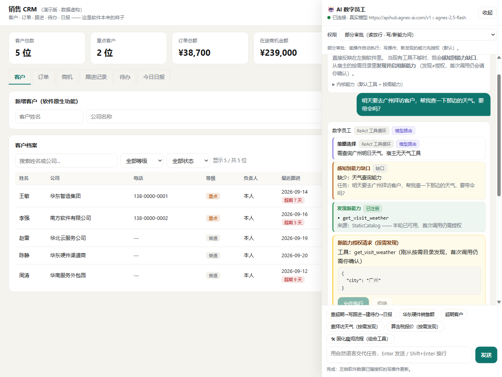
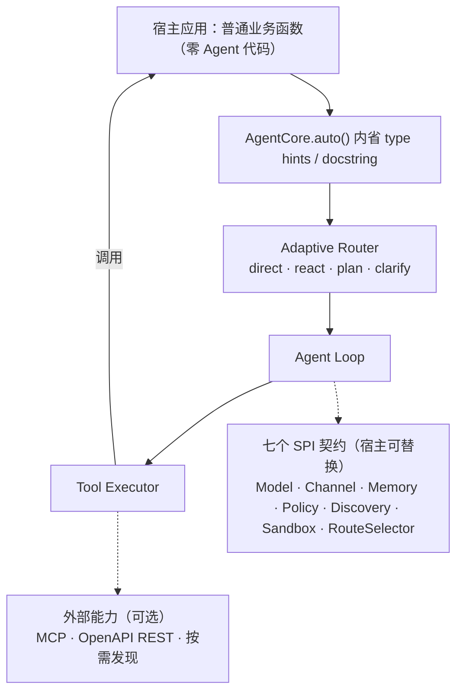
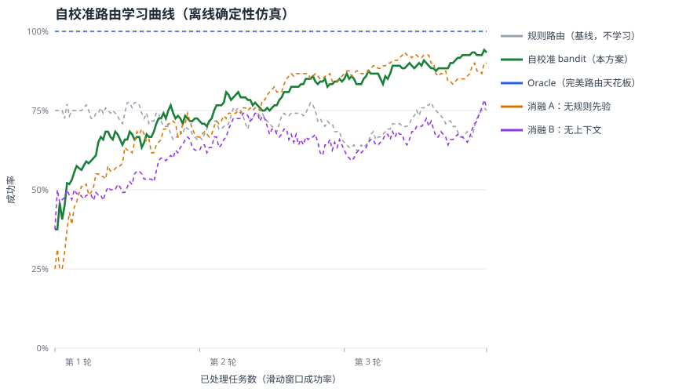
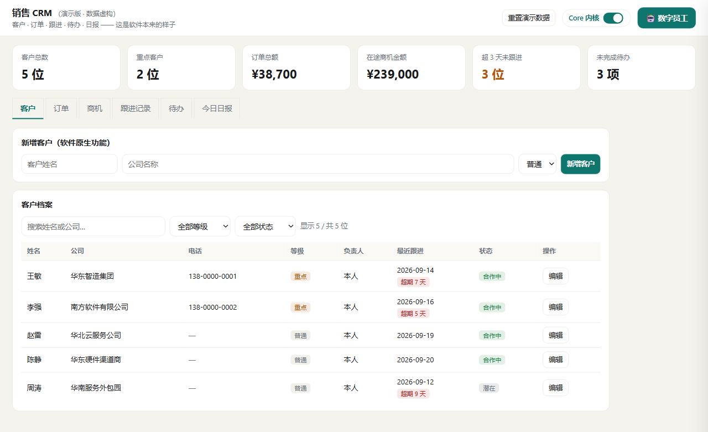

# YAI Agent Core

[](https://github.com/Gi-Tuu/yai-agent-core/actions/workflows/ci.yml)
[](LICENSE)
[](https://www.python.org/downloads/)
[](https://github.com/Gi-Tuu/yai-agent-core/tree/main/tests)
[](pyproject.toml)

> 进程内嵌入式、自适应的 Agent 内核（Embeddable Self-Adaptive Agent Kernel）。
> 宿主软件只声明"我有什么能力"，Core 自动发现能力、自适应选择策略并完成任务——**宿主不写一行 Agent Loop / Planner / 工具选择代码**。



<p align="center"><b>一个普通销售 CRM 零改造嵌入 Core</b>：问"明天去广州拜访要带伞吗"，现有工具都不覆盖天气 →
内核感知能力缺口 → 从按需目录发现并注册天气工具 → 首次调用仍弹授权卡，允许后才执行。截图数据均为虚构。</p>

## 定位：不是又一个 Agent 框架

| 形态 | 数据库类比 | Agent 世界 | 你要做什么 |
|---|---|---|---|
| 平台/SaaS | 云数据库控制台 | Dify、Coze | 注册账号在平台里搭 |
| 框架/SDK | ORM | LangGraph、CrewAI、OpenAI/Claude Agents SDK | 自己定义 Agent、工具、编排 |
| **嵌入式内核（本项目）** | **SQLite** | YAI Agent Core | **把现有软件接进来，能力自动长出来** |



## 30 秒快速开始

### 路线 A：只装库，零 Key 验证嵌入（不必克隆、不必申请模型）

内核本体**零第三方硬依赖**，Python 3.11+ 直接装：

```bash
pip install "yai-agent-core @ git+https://github.com/Gi-Tuu/yai-agent-core.git"
# 接真实模型时再加可选依赖：pip install "yai-agent-core[llm] @ git+https://github.com/Gi-Tuu/yai-agent-core.git"
```

复制这段直接运行——用随包的确定性 `ScriptedModel`，**不联网、不要 API Key**，
就能看到内核自动发现并执行你的业务函数（这段也是 `tests/test_quickstart.py` 的真身）：

```python
import asyncio
from yai_core import AgentCore, ScriptedModel, ModelResponse, ToolCallRequest, build_spec

def search_notes(keyword: str) -> list[str]:
    """搜索宿主笔记库。"""                 # 你自己的普通业务函数，没有任何 Agent 代码
    return {"周报": ["Core 骨架", "工具调用"]}.get(keyword, [])

# 离线确定性模型：第一轮决定调工具，第二轮给结论（真实上线整体换成 OpenAICompatProvider）
model = ScriptedModel([
    ModelResponse(content="", tool_calls=[ToolCallRequest(id="c1", name="search_notes",
                 arguments={"keyword": "周报"})]),
    ModelResponse(content="本周周报 2 条。"),
])

core = AgentCore(model)
core.register_tools([build_spec(search_notes)])            # 内省 type hints/docstring 生成工具
result = asyncio.run(core.run("搜索周报并总结"))
print(result.final_text)                                  # 本周周报 2 条。
```

接真实模型时，把 `ScriptedModel` 换成一行（`[llm]` extra，OpenAI 兼容 DeepSeek/通义/OpenAI）：

```python
from yai_core import OpenAICompatProvider
model = OpenAICompatProvider()   # 读 OPENAI_API_KEY / OPENAI_BASE_URL / LLM_MODEL
```

### 路线 B：克隆仓库，跑全部宿主演示与测试（离线，无需 Key）

```bash
uv venv
uv pip install -e ".[dev,llm,server]"
uv run python scripts/smoke_test.py   # 离线冒烟：同一 Core 自适应三个不同宿主
uv run pytest                         # 全量单元 + 端到端测试，不需要 API Key
# 全量 extras（与 CI 一致）：uv sync --extra dev --extra llm --extra server --extra mcp --extra openapi
```

**第一次读代码**：[`docs/reading-guide.md`](docs/reading-guide.md) 是学习路线；[`docs/walkthrough/00-index.md`](docs/walkthrough/00-index.md) 是每个源码文件的逐行讲解。

宿主接入只有三步（真实模型）：

```python
from yai_core import AgentCore, OpenAICompatProvider
import my_app_capabilities as cap                # 宿主自己的普通业务函数

core = AgentCore.auto(cap, OpenAICompatProvider())   # ① 内省宿主能力，自动注册工具
result = await core.run("搜索本周记录并整理成报告")      # ② 自适应：direct/react/plan/clarify
print(result.final_text)                           # ③ 可交付结果 + 全程事件可观测
```

## 自适应机制（当前能力）

1. **能力自发现**：Python 函数 type hints + docstring 自动生成 JSON Schema 工具规格；外部 MCP Server 的工具经 MCP Client 同构接入注册表（v0.2 已落地，`[mcp]` 可选依赖）
2. **接入任意 REST API（OpenAPI 发现，可选）**：给一个 OpenAPI 3 描述（URL/文件/dict），自动把 operations 注册为工具（$ref 内联、path/query/body 入参合并、bearer/apiKey 鉴权、只读模式），`[openapi]` extra 懒加载
3. **策略自适应**：Adaptive Router 将任务路由到 `direct / react / plan / clarify`；规则实现零成本可测，LLM 分类器输出 `{strategy, reason, tier, missing_capability}`，异常/超时/非法输出自动回退规则，决策来源随事件流可审计；LLM 路由同时做能力边界感知，工具不足时发出 `capability_missing` 事件交给宿主（规则路径、澄清、无工具部署不发）
4. **自校准路由学习（contextual bandit，可选）**：路由不再是开环的一次性判断——任务结束后从事件流抽取成败，按 9 维任务特征分桶累计 Beta(α,β) 后验，用 Thompson Sampling 为同类任务选策略；冷启动注入规则先验（首次建议≈规则），纯标准库、零依赖、状态可 JSON 持久化。默认关闭、空任务/无工具等硬规则区域不表态，新增第七个 SPI `RouteSelector` 可整体替换学习算法。离线 benchmark（8 seeds × 3 epochs）末段成功率 **91.3% vs 规则 73.3%（+18pp）**，五线含消融，见下图与讲义第 19 篇
5. **能力按需发现闭环（ToolDiscovery）**：第 5 个 SPI 契约。模型报出能力缺口后，内核向发现源（内置进程内 `StaticCatalog`，未来可接 MCP 目录 / OpenAPI 服务 / 插件市场）要候选 → 去重注册 → 发 `tool_discovered` 事件 → **本轮 ReAct 即可调用**；发现源异常不致命，且"能被发现不等于被授权执行"（执行仍走权限策略）。默认不配置发现源时行为不变，离线可复现（`examples/host_f_discovery/`）
6. **模型自适应**：标准任务/规划任务可路由到不同模型（tier: standard/strong），失败可回退；OpenAI 兼容（DeepSeek、通义千问等）；`llm_router="auto"` 按模型后端的 `yai_live_router` 能力标记自动开关 LLM 路由
7. **宿主自适应（SPI）**：Model / Channel / Memory / Policy / Discovery / Sandbox / RouteSelector 七个契约宿主可替换，Core 提供零配置默认实现
8. **组合工具（不越界地造工具）**：模型可通过 `compose_tool` 把宿主已注册工具编排成新工具（`AgentCore(composition=True)`）；组合工具只能引用已注册工具、执行时每步仍走权限，能力上限 = 被组合工具的并集，且不执行任何模型生成的代码。代码生成工具则只定义 `ToolSandbox` SPI 契约（沙箱由宿主提供），内核不内置执行器
9. **权限三档与每轮反思**：全部审批 / 部分审批（读白名单自动、写操作询问，默认）/ 无需审批三档可运行时切换；工具失败后把原因回灌模型反思，换工具或如实说明缺口，不重复同一失败调用
10. **过程可观测**：每次策略选择、能力缺口、工具发现、工具组合、工具调用、权限确认都通过 Observer 事件流对外发出



## 目录结构

```
src/yai_core/
├── core.py              # AgentCore 门面（auto / run / astream）
├── types.py             # ToolSpec / ChatMessage / AgentEvent / Strategy
├── spi/                 # 宿主可替换契约：model / channel / memory / policy / discovery / sandbox / learning
├── discovery/           # 能力自发现（函数内省）+ catalog.py（按需能力目录）
├── tools/               # ToolRegistry + ToolExecutor + 组合工具（composer）
├── kernel/              # AdaptiveRouter + AgentLoop + Context
├── learning/            # 自校准路由（可选）：特征/反馈/上下文老虎机，零第三方依赖
├── llm/                 # OpenAI 兼容模型后端（可选依赖）
├── memory/ policy/ channels/   # 默认实现（内存记忆 + SQLite 持久化 opt-in / 白名单权限 / CLI·收集通道）
├── integrations/
│   ├── mcp/             # MCP Client 桥接（可选 [mcp] 依赖，懒加载，v0.2）
│   └── openapi/         # OpenAPI 3 发现 → 工具（可选 [openapi] 依赖，懒加载，v0.2）
└── batteries/
    └── fastapi_server/  # 在线 API + /health + X-Agent 验证端点
examples/
├── host_a_notes/        # 宿主 A：笔记应用（只有业务函数，零 Agent 代码）
├── host_b_data/         # 宿主 B：销售数据应用（同一 Core 零修改适配）
├── host_c_companion/    # 宿主 C：AI 陪伴应用（AMBRACE 回流形态预演）
├── host_d_mcp/          # 宿主 D：接入外部 MCP Server 工具（自带 stdio 演示 Server）
├── host_e_sales_crm/    # 宿主 E：销售 CRM——独立菜单软件零 AI 依赖可运行，同一 SalesCrm 对象零改造嵌入；含终端与网页工作台两种形态
└── host_f_discovery/    # 宿主 F：能力缺口 → 按需发现 → 本轮可用（离线确定性演示，无需 Key）
tests/                   # 离线 ScriptedModel 端到端测试
docs/                    # 架构设计、代码学习导览、三个比赛的提交清单
```

## 接入外部 MCP 工具（v0.2）

```bash
uv pip install -e ".[mcp]"          # 或 uv sync --extra mcp
uv run python examples/host_d_mcp/run.py   # 自带本地 stdio 演示 Server，离线可跑

# 改接任意公共 MCP Server（HTTP 形态），无需改代码：
$env:MCP_SERVER_URL="https://mcp.deepwiki.com/mcp"   # PowerShell
uv run python examples/host_d_mcp/run.py "用 MCP 工具问一下 modelcontextprotocol/python-sdk：Client 怎么初始化？"
```

在线 API 同样靠环境变量挂载外部 MCP（`scripts/serve_example.py` 的 lifespan
启动挂载、关闭断开、失败降级为仅本地工具）；线上实例默认挂公共免鉴权的 DeepWiki，
评审可直接 POST 任务让服务真实调用远程 MCP 工具。

```python
from yai_core.integrations.mcp import McpServerConfig, attach_mcp_tools

# Streamable HTTP：McpServerConfig(alias="x", url="https://host/mcp")
# stdio 子进程：  McpServerConfig(alias="x", command="uv", args=["run","server.py"])
bridge = await attach_mcp_tools(core.registry, McpServerConfig(alias="demo", url=url))
# 远端工具已作为 ToolSpec(source="mcp") 注册，Router/Loop/Executor 零感知
await bridge.aclose()
```

## 能力按需发现：缺口 → 发现 → 本轮可用（宿主 F）

宿主可以把"非默认能力"放进一个按需目录，而不是启动时全部注册。模型在分类时
判定现有工具不足，会输出 `missing_capability`；内核据此向 `ToolDiscovery` 发现源
要候选，命中后注册并在**同一轮**交给模型调用。默认能力之外的工具不会凭空出现，
注册后的执行仍走权限策略。

```bash
uv run python examples/host_f_discovery/run.py   # 离线确定性演示，无需 API Key
```

```python
from yai_core import AgentCore, StaticCatalog, DiscoveredCandidate, build_spec

catalog = StaticCatalog([
    DiscoveredCandidate(get_weather, ("天气", "气温", "weather"))  # 显式关键词才可能被发现
])
core = AgentCore(model, llm_router=True, discovery=catalog)
core.register_tools([build_spec(list_tasks), build_spec(add_task)])  # 只注册默认能力
```

`StaticCatalog` 是 `ToolDiscovery` SPI 的最小进程内实现（关键词匹配、零依赖、离线可测）；
同一契约未来可挂 MCP 目录、OpenAPI 服务目录或插件市场。完整事件序列：
`capability_missing → tool_discovered → tool_call → tool_result → done`。

## 普通软件零改造嵌入（宿主 E：销售 CRM）

`examples/host_e_sales_crm/` 首先是一个**不依赖 YAI 也能完整运行**的销售 CRM 小软件
（`crm_app.py` 全文不导入 yai_core，菜单 CLI、JSON 持久化、18 个业务方法（10 读 8 写））；
同一个 `SalesCrm` 实例交给 `AgentCore.auto` 即得到数字员工——应用内提供 Core 开关，可一键对比有无 Core；
权限支持全部审批 / 部分审批（读放行、写授权，默认）/ 无需审批三档，多步任务自动规划并产出销售日报；
模型还能把现有工具编排成组合工具（创建与每步执行都受权限约束），能力缺口则走按需发现闭环。

```bash
# 没有 AI：独立菜单软件
uv run python examples/host_e_sales_crm/standalone_cli.py
# 嵌入 Core：自然语言数字员工（终端形态，默认任务演示 plan + 两次写授权 + 日报）
uv run python examples/host_e_sales_crm/run_agent.py
uv run python examples/host_e_sales_crm/run_agent.py "华东区硬件类的销售额是多少？"
# 嵌入 Core：网页工作台（原生 CRM 界面 + 右侧可收起的 AI 数字员工抽屉）
uv run python examples/host_e_sales_crm/web_app.py        # http://127.0.0.1:8200
```

网页工作台纯标准库实现（`http.server` + SSE，零第三方依赖）。打开后首先是**软件本来的样子**：
客户 / 订单 / 商机 / 跟进 / 待办 / 日报六个原生视图与原生录入表单，不依赖 Core 完整可用；
点右上角"AI 数字员工"才展开右侧抽屉，用自然语言交代任务——读工具自动放行，写工具经 SSE
推送授权卡片，浏览器点"允许/拒绝"后任务继续，执行结果实时反映在左侧原生界面（KPI、表格联动）。
Agent 执行中原生写操作互斥（409），避免两边同时改数据；任务可随时终止，重置会先终止卡住的任务。
只监听 127.0.0.1。



*上图：软件本来的样子——客户 / 订单 / 商机 / 跟进 / 待办 / 日报六个原生视图，没有 Core 也完整可用。*

工作台还内置了**按需能力目录**（`catalog_capabilities.py`：拜访天气、含税报价两个销售域能力）：
它们默认不注册、不计入 18 个 CRM 工具；当模型判定现有工具不足（如"明天去广州拜访要带伞吗"），
内核发出 `capability_missing` → 按关键词从目录匹配并注册新工具（`tool_discovered`）→ 本轮即可调用，
首次调用仍弹授权卡（**发现 ≠ 授权**）。抽屉里的"按需能力"分组与两个演示 chip 可直接触发这条闭环。
Windows 下双击 `examples/host_e_sales_crm/启动数字员工.cmd` 即可一键启动（等价于上面的 web_app.py）。

这条"感知缺口 → 发现 → 授权 → 调用"的完整闭环，就是文首主图展示的画面：内核发出 `capability_missing`
（琥珀色）→ 从按需目录发现并注册 `get_visit_weather`（绿色）→ 首次调用仍弹"新能力授权请求"（黄色），
允许后才执行。**发现 ≠ 授权**，宿主始终掌握最终控制权。（截图中的客户、订单、天气均为虚构演示数据。）

## 在线 API（X-Agent 部署要求）

```bash
uvicorn 启动示例见 docs/architecture.md
GET  /health                                # {"status":"ok","commit":"..."}
GET  /.well-known/xagent-verification.json  # {"schemaVersion":1,"slug":...,"commit":...}
GET  /v1/tools                              # 当前宿主自动发现的工具清单
POST /v1/agent/run                          # {"task": "..."} -> 事件流 + 最终结果
```

部署相关环境变量（完整清单见 `.env.example`）：

```bash
# 持久化记忆（可选）：设置后落 SQLite，重启不丢
YAI_DB_PATH=data/yai.db
# 历史保留策略（可选）：条数上限 / TTL 秒数，按轮对齐裁剪
YAI_HISTORY_MAX_MESSAGES=200
YAI_HISTORY_TTL_SECONDS=604800
# 评审期限流（默认开启）：每 IP 每窗口 30 次 POST；0 关闭
YAI_RATE_LIMIT_ENABLED=1
YAI_RATE_LIMIT_PER_MINUTE=30
YAI_RATE_LIMIT_WINDOW_SECONDS=60
```

## 版本路线

- **v0.1（已完成）**：函数内省、规则路由、Agent Loop、SPI 默认实现、FastAPI Battery、三宿主 demo、容器化与 PaaS 部署
- **v0.2（已完成）**：MCP Client、LLM 路由器（规则兜底）、SQLite 持久化记忆（opt-in，`YAI_DB_PATH`）、OpenAPI 发现（opt-in，`OPENAPI_SPEC_URL/PATH`）
- **v0.3（部分完成）**：历史保留策略（条数裁剪/TTL，opt-in，轮边界对齐，已落地）、限流 Battery（已落地）；检查点与失败恢复、Flutter Channel（后续）
- v1.0：作为 AMBRACE 的 Agent 内核回流嵌入

## 许可证

MIT
