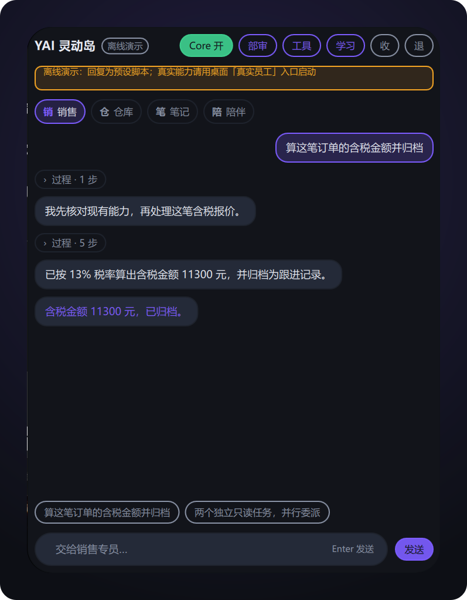
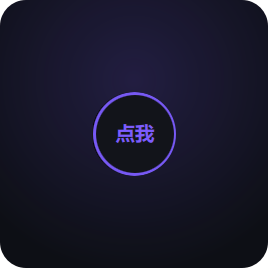

# YAI Agent Core

[](https://github.com/Gi-Tuu/yai-agent-core/actions/workflows/ci.yml)
[](LICENSE)
[](https://www.python.org/downloads/)
[](CHANGELOG.md)
[](pyproject.toml)

<p align="center"><b>给每个软件，一颗会思考的心脏。</b></p>

> 进程内嵌入式、**自适应**的 Agent 内核 —— **Agent 世界的 SQLite**。
> 不必部署一个智能体平台，也不必写 Agent Loop / Planner / 工具选择代码：把内核 `import`
> 进你**已有的软件**，宿主只声明“我有什么能力”，Core 自动发现能力、选策略、调工具、完成任务。

<p align="center">
  
</p>

<p align="center"><b>一个浮窗，就是一个数字员工。</b> 对话为主体，思考链与工具调用折叠成“过程 · N 步”；
路由、能力缺口、新工具飞入、授权卡全部由真实内核事件驱动。截图数据均为虚构。</p>

## 这是什么

YAI 不是又一个聊天机器人，也不是让你照着教程拼装的 Agent 框架。它是一个**跑在你软件进程里的内核**：

- 你把软件里**本来就存在的普通函数**交给它（或接入 MCP / OpenAPI）；
- 它内省这些能力、自动生成工具规格，在收到任务时**自适应**地决定直接回答、调用工具、分步规划，还是向你澄清；
- 能力不足时能**感知缺口、按需发现新工具**，高危操作默认**先请求授权**——每一步都以事件对外可见。

## 适合谁 / 不适合谁

| ✅ 适合你，如果…… | ⛔ 不适合你，如果…… |
|---|---|
| 已有一个能跑的软件，想**低成本加上 Agent 能力**，且不被平台锁定 | 想在网页上**拖拽搭 Agent**、完全不写代码（用 Dify / Coze） |
| 想让 AI 调用你软件的**真实功能**，而不是通用闲聊 | 想要开箱即用的**云端托管 / 团队 SaaS** 智能体 |
| 需要可**自托管、可内嵌**、各部件可替换的 Agent 运行时 | 想要无人值守、全自动的 **coding agent**（YAI 刻意默认要授权） |
| 想边做边学 Agent 内部原理（每个决策可审计、有逐行讲义） | 期望零配置的通用助手——YAI 的价值恰恰在**绑定宿主能力** |

## 和你听过的东西有何不同

|  | 平台<br>Dify / Coze | 框架<br>LangGraph · CrewAI · Agents SDK | **嵌入式内核 · YAI** |
|---|---|---|---|
| 形态 | 注册账号，在平台里搭 | 自己定义 Agent / 工具 / 编排 | **`import` 进现有软件** |
| 要写的 Agent 代码 | — | 多 | **无** |
| 部署方式 | 平台托管 | 自己起一个服务 | **随宿主进程，无独立服务** |
| 绑定宿主能力 | 弱、需手动接 | 手动接 | **自动内省发现** |
| 内核第三方硬依赖 | — | 通常较多 | **0**（全部可选、懒加载） |

> 数据库类比：平台是云数据库控制台，框架是 ORM，**YAI 是 SQLite** —— 不抢主角，安静地嵌进你的程序。

## 30 秒跑起来

**路线 A · 只装库、零 Key 验证嵌入**（不必克隆、不必申请模型）。内核本体零第三方硬依赖：

```bash
pip install "yai-agent-core @ git+https://github.com/Gi-Tuu/yai-agent-core.git"
```

```python
import asyncio
from yai_core import AgentCore, ScriptedModel, ModelResponse, ToolCallRequest, build_spec

def search_notes(keyword: str) -> list[str]:
    """搜索宿主笔记库。"""                # 你自己的普通业务函数，没有任何 Agent 代码
    return {"周报": ["Core 骨架", "工具调用"]}.get(keyword, [])

# 离线确定性模型（真实上线整体换成 OpenAICompatProvider）：先调工具，再给结论
model = ScriptedModel([
    ModelResponse(content="", tool_calls=[ToolCallRequest(id="c1", name="search_notes",
                 arguments={"keyword": "周报"})]),
    ModelResponse(content="本周周报 2 条。"),
])
core = AgentCore(model)
core.register_tools([build_spec(search_notes)])      # 内省 type hints / docstring 生成工具
print(asyncio.run(core.run("搜索周报并总结")).final_text)   # 本周周报 2 条。
```

接真实模型只需换一行（`[llm]` extra，OpenAI 兼容 DeepSeek / 通义 / OpenAI / Agnes）：

```python
from yai_core import OpenAICompatProvider
model = OpenAICompatProvider()      # 读 OPENAI_API_KEY / OPENAI_BASE_URL / LLM_MODEL
```

**路线 B · 克隆仓库，跑全部宿主与测试**（离线，无需 Key）：

```bash
uv venv
uv pip install -e ".[dev,llm,server]"
uv run python scripts/smoke_test.py   # 同一 Core 自适应多个不同宿主
uv run pytest                         # 全量测试，不需要 API Key
```

第一次读代码：[`docs/reading-guide.md`](docs/reading-guide.md) 是学习路线，[`docs/walkthrough/00-index.md`](docs/walkthrough/00-index.md) 是逐行讲解。

## 核心能力

| 能力 | 一句话 |
|---|---|
| **能力自发现** | Python 函数 type hints + docstring 自动生成 JSON Schema；外部 **MCP** 工具经 MCP Client、**OpenAPI** REST 操作经规范解析，同构接入注册表 |
| **自适应路由** | 任务路由到 `direct / react / plan / clarify`；LLM 分类异常自动回退规则，工具不足时发出 `capability_missing`，决策全程可审计 |
| **自校准学习** | 上下文 bandit 从成败中学习路由，Thompson Sampling 选策略；离线 benchmark 末段 **89.6% vs 规则 73.3%（约 +16pp）** |
| **按需发现闭环** | 缺口 → 向发现源要候选 → 注册 → **本轮即可调用**；支持词法 + 本地 bge-m3 / 云端 embedding 双通道语义召回 |
| **安全边界** | 权限三档（全部 / 部分 / 无需审批）；组合工具只编排已注册工具、不执行生成代码；代码生成仅定义 `ToolSandbox` 契约、沙箱由宿主提供 |
| **全程可观测** | 每次策略选择、能力缺口、工具发现 / 组合 / 调用、权限确认都通过统一事件流对外发出 |

<details>
<summary>展开：八个可替换 SPI 契约</summary>

`Model · Channel · Memory · Policy · Discovery · Sandbox · RouteSelector · Embedding`
——宿主可替换任意一个，Core 提供零配置默认实现。内核本体始终零第三方硬依赖。

</details>

## 两种用法

### 1）作为库嵌入（三步）

```python
from yai_core import AgentCore, OpenAICompatProvider
import my_app_capabilities as cap                       # 宿主自己的普通业务函数

core = AgentCore.auto(cap, OpenAICompatProvider())      # ① 内省能力，自动注册工具
result = await core.run("搜索本周记录并整理成报告")        # ② 自适应 direct/react/plan/clarify
print(result.final_text)                                # ③ 可交付结果 + 全程事件
```

### 2）灵动岛员工薄壳（`shell/desktop`）

需要一张“脸”的宿主**不必自己写交互窗口**：官方薄壳提供一个常驻浮窗，Qt Quick 真原生渲染、
与各应用内置的 Core 跑在**同一进程**（无本地端口）。

<p align="left">
  
</p>

- **三态形变**：圆形球（56）→ 悬停向右展开胶囊（340×52）→ 点击向下展开员工面板（470×620），全程可拖动；
- **位置记忆**：拖动后关闭重开，浮窗回到原处；
- **首次引导**：球内“点我” + 紫色呼吸环，引导一次后不再出现；
- **全局快捷键**：在任意软件按 `Ctrl+Alt+Y` 立刻呼出并展开；
- **离线 / 真实双入口**：桌面快捷方式分别启动离线演示与接真实模型的员工；
- **多专员切换**：一座岛管理销售 / 仓库 / 笔记 / 陪伴多个**彼此隔离**的专员，时间线不丢 ——
  灵动岛只做前台 / 交换机，**不做超级 Agent**。

```bash
uv sync --extra desktop
.\.venv\Scripts\python.exe -m shell.desktop            # 离线演示：无 Key 看全部动效
.\.venv\Scripts\python.exe -m shell.desktop --live     # 接真实模型
```

薄壳只做呈现与编排；`shell/employee` 把子员工实现为“收窄工具 + 收窄权限 + 独立上下文 + 预算”的
一次 sub-run（并行 ≤ 5、嵌套 ≤ 2、结果只回流根），**内核不感知界面、也不做多 Agent 框架**。

## 截图墙

<p align="center">
  
&nbsp;&nbsp;
  
</p>

<p align="center"><b>左：</b>软件本来的样子（六个原生视图，无 Core 也完整可用）；
<b>右：</b>嵌入 Core 后，能力不足时自动发现工具、首次调用仍弹授权卡（发现 ≠ 授权）。</p>

<p align="center">
  
</p>

## 示例（由浅入深）

| # | 宿主 | 看什么 |
|---|---|---|
| 1 | `host_a_notes` | 最小接入：普通函数自动变工具 |
| 2 | `host_c_companion` | 换领域即换岗位（AMBRACE 预演） |
| 3 | `host_d_mcp` | 作为 Client 接入外部 MCP Server |
| 4 | `host_f_discovery` | 能力缺口 → 发现 → 本轮可用（静态 / 语义） |
| 5 | `host_g_sandbox` | 教学沙箱：现场造代码工具并执行 |
| 6 | `host_e_sales_crm` | 旗舰：独立 CRM，一个开关嵌入 Core（终端 + 网页，端口 8200） |
| 7 | `host_i_mealie` | 适配真实第三方高 star 开源项目（Mealie） |

> 目录名保留历史编号（a/c/d/e/f/g/i），不随学习顺序重排，以便与各版材料、讲义路径一致。

## 在线 HTTP API

线上实例：**https://yai-agent-core.onrender.com**（免费层冷启动约 30–90s）

```bash
GET  /health                  # {"status":"ok", ...}
GET  /v1/tools                # 当前宿主自动发现的工具清单
POST /v1/agent/run            # {"task": "..."} -> 事件流 + 最终结果
```

可选环境变量（持久化记忆、历史裁剪 / TTL、限流等）见 [`.env.example`](.env.example) 与 [`docs/architecture.md`](docs/architecture.md)。

## 版本路线

- **v0.1 – v0.3（已完成）**：函数内省、规则 / LLM 路由、Agent Loop、SPI 默认实现、MCP Client、SQLite 持久化、OpenAPI 发现、历史裁剪与限流、容器化部署
- **v0.4 – v0.6（已完成）**：能力缺口感知与 ToolDiscovery 闭环、host_e CRM 零改造嵌入、权限三档、组合工具、双通道语义发现、执行中动态发现
- **v0.7（已完成，本版）**：自校准路由 contextual bandit（离线 +16pp）、代码工具注册 / TTL / 授权闸、子进程教学沙箱、灵动岛员工薄壳
- **v1.0（规划中）**：作为 AI Companion 项目 [AMBRACE](https://github.com/Gi-Tuu/AMBRACE) 的 Agent 内核回流嵌入

## 许可证

MIT · [Gi-Tuu](https://github.com/Gi-Tuu)
