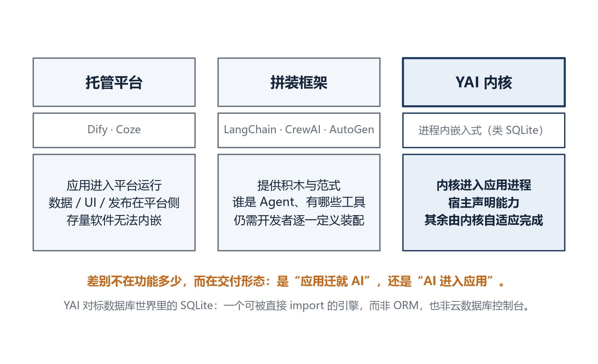
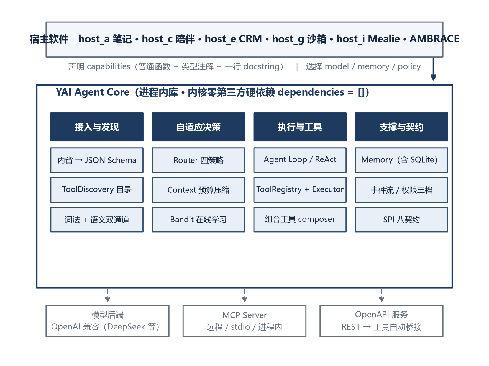
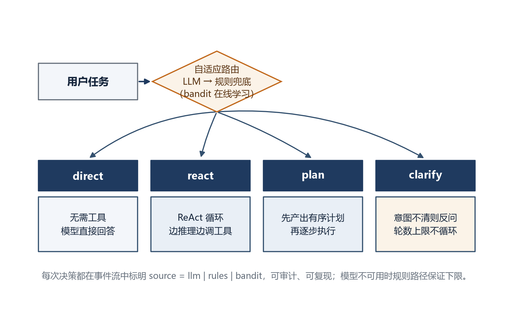
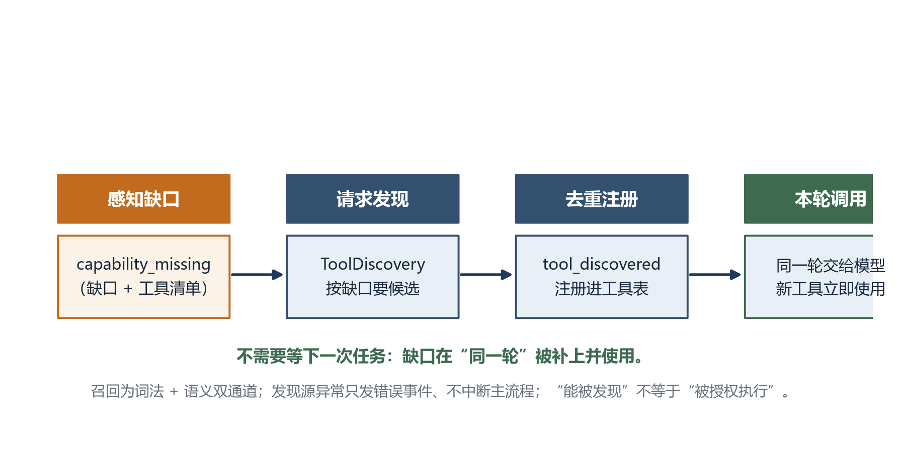
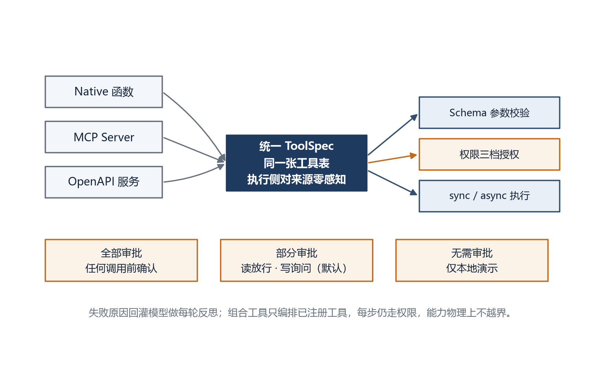
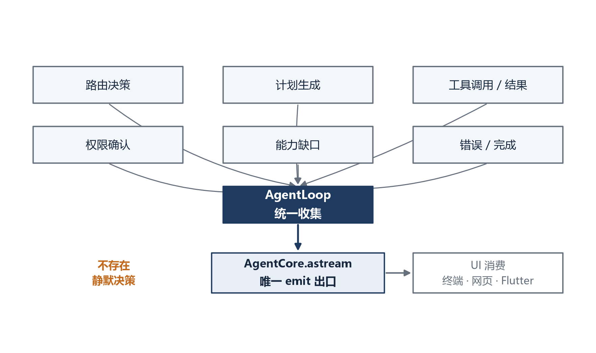
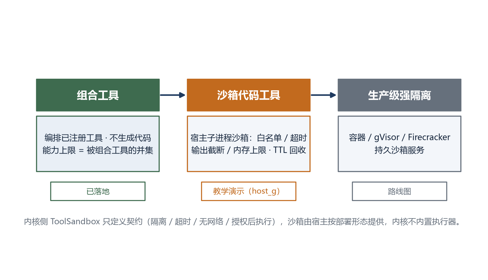

# YAI Agent Core

> 进程内嵌入式自适应 Agent 内核

> 2026 上海开源软件应用创新大赛 · 开源 AI 工具赛道参赛作品　作者：Gi-Tuu（单人参赛，队名 YAI）

| 项目信息 | 内容 |
|---|---|
| 项目名称 | YAI Agent Core（yai-agent-core） |
| 作品类别 | 开源 AI 工具 · Agent 基础设施 / 运行时 |
| 主要语言 | Python 3.11+（内核），标准库网页示例 |
| 许可证 | MIT |
| GitHub 仓库 | https://github.com/Gi-Tuu/yai-agent-core |
| Gitee 仓库 | https://gitee.com/Gi-Tuu/yai-agent-core |
| 在线实例 | https://yai-agent-core.onrender.com |
| 当前版本 | v0.7.0（GitHub Release） |
| 文档日期 | 2026 年 9 月 |

## 摘要

大模型能力持续增强，但一个已经存在的软件——笔记应用、CRM、陪伴 App、内部系统——要获得真正的 Agent 能力，今天仍需自行选择框架、接入模型、定义工具、编写 Agent Loop、规划器、记忆、权限、可观测与部署运维，"应用 AI 化"的工程成本被严重低估。现有方案中，托管平台要求应用迁入平台、拼装框架仍需开发者逐一定义装配、自建则重复造轮子。

YAI Agent Core 提出并实现了另一种形态：**进程内嵌入式的 Agent 内核**——在数据库世界中对标的是 SQLite，而非 ORM 或云数据库控制台。宿主软件只做一件事：以普通 Python 函数（类型注解加一行 docstring）声明"我有什么能力"；内核在应用进程内自动完成能力发现、意图理解、策略选择、工具调用、记忆与可审计交付，宿主不编写任何 Agent Loop / Planner / 工具选择代码。能力长在应用进程里，不引入服务端、不锁定模型厂商、不抽成、数据不出宿主。

截至当前版本，内核本体保持**零第三方硬依赖（`dependencies` 为空）**，通过 **8 个 SPI 契约**隔离一切外部能力；以 **14 类事件**经唯一出口流式发布每个自适应决策；提供 **395 项自动化测试**（全部离线、不依赖网络与密钥）；仓库内置 **8 个形态各异的宿主示例**与 **20 篇源码逐行讲义**，并在真实的高 star 开源软件 Mealie 上完成端到端验证。

**关键词：** 智能体内核；进程内嵌入；自适应路由；工具调用；模型上下文协议（MCP）；能力发现；开源 AI 工具

## 第一章 项目背景与问题定位

### 1.1 软件"AI 化"的成本被严重低估

大模型能力越来越强，但把一个已经存在的软件（笔记应用、CRM、陪伴 App、内部系统）改造为具备 Agent 能力的产品，今天的主流路径仍然是：选一个 Agent 框架，自己接模型、定义工具、写 Agent Loop、写规划器、写记忆、做权限、做可观测、做部署运维。这条链路的工作量，远大于"调一次大模型 API"。

### 1.2 现有三类形态及其边界

市面上的方案大致分为三类，如图 1 所示：

1. **托管平台**（Dify、Coze 等）：可视化编排、开箱即用，但应用必须运行在平台里或以平台为服务端，数据、UI、发布节奏都在平台侧，存量软件无法"内嵌"。
2. **拼装框架**（LangChain/LangGraph、CrewAI、AutoGen 等）：提供积木与编排范式，但"谁是 Agent、有哪些工具、流程怎么转"仍需开发者逐一定义与装配，框架本身不感知宿主软件已经具备什么能力。
3. **自建 Agent**：可控但重复造轮子，每个软件都要重写一遍循环、工具总线和记忆。



### 1.3 另一种形态：进程内嵌入式 Agent 内核

**YAI Agent Core 提出另一种形态：进程内嵌入式的 Agent 内核（对标数据库世界里的 SQLite，而不是 ORM 或云数据库控制台）。** 宿主软件只做一件事——声明"我有什么能力"（普通 Python 函数加类型注解与一行 docstring），内核在进程内自动完成能力发现、意图理解、策略选择、工具调用、记忆与可审计交付，**宿主不写一行 Agent Loop / Planner / 工具选择代码**。

```python
# 宿主侧全部接入成本（examples/host_a_notes/run.py 同构）
from yai_core import AgentCore
core = AgentCore.auto(capabilities, model)   # capabilities 是普通函数
result = await core.run("帮我统计一下笔记数量")
# 内核自适应选择 direct/react/plan/clarify
```

这一形态直接服务于"应用 AI 化"的真实成本：能力长在应用进程里，不引入服务端、不锁定模型厂商、不抽成、数据不出宿主。差别不在功能多少，而在交付形态——是"应用迁就 AI"，还是"AI 进入应用"。

## 第二章 技术架构

### 2.1 分层结构

系统整体分为三层：宿主软件声明能力并选择外部后端；YAI Agent Core 在进程内完成接入发现、自适应决策、执行与支撑；模型后端、MCP Server、OpenAPI 服务作为可选外部能力经契约接入，如图 2 所示。

```text
宿主软件（host_a / host_c / host_e / host_g / host_i / 任意 Python 软件 / AMBRACE）
  │  声明 capabilities（普通函数）+ 选择 model/channel/memory/policy
  ▼
YAI Agent Core（进程内库，内核本体零第三方硬依赖，dependencies = []）
```



内核各模块职责如表 1 所示。

**表 1　内核模块职责一览**

| 模块 | 职责 |
|---|---|
| discovery/introspect | 能力自发现：函数 type hints + docstring → JSON Schema |
| kernel/router | 自适应路由 direct/react/plan/clarify（规则兜底 + LLM 增强 + bandit 学习） |
| kernel/context | 上下文组装与字符预算压缩（轮边界对齐） |
| kernel/loop | Agent Loop：ReAct 循环 / 先规划后执行 / 澄清 / 收尾 |
| tools/ | ToolRegistry + ToolExecutor（Schema 校验 → 权限 → 执行）+ 组合工具 composer |
| discovery/catalog | 按需能力目录：StaticCatalog 词法 + SemanticCatalog（embedding）双通道召回 |
| policy/allowlist | 权限三档收口（全部审批 / 读放行写授权 / 无需审批） |
| memory/ | 内存 + SQLite 持久化（opt-in）+ 条数/TTL 保留策略 |
| spi/ | model / channel / memory / policy / discovery / sandbox / embedding / learning 八个可替换契约 |
| integrations/mcp | MCP Client（Streamable HTTP / stdio / 进程内直连） |
| integrations/openapi | OpenAPI 3 发现 → 工具自动桥接（$ref 内联、只读模式、鉴权） |
| batteries/fastapi_server | /health、/v1/tools、/v1/agent/run + 限流（可选） |

### 2.2 能力自发现

宿主的普通函数经内省自动生成 JSON Schema 工具规格；外部 MCP Server 工具与 OpenAPI 服务操作被转换成同构的 `ToolSpec`，注册进同一张工具表，执行侧对工具来源零感知。目前工具来源有三类：native 函数、MCP Server（远程/本地）、OpenAPI REST 服务。

### 2.3 自适应路由

每个任务进入内核后先做一次路由，在四种策略间选择，如图 3 所示：

- `direct`：无需工具，模型直接回答；
- `react`：ReAct 循环，边推理边调工具；
- `plan`：多步任务先由模型产出有序计划（发 `plan_created` 事件），再逐步执行；
- `clarify`：意图不清时向用户反问，带轮数上限、上下文累积与空回答收尾，不会无限追问。



路由有两条路径：LLM 分类输出 `{strategy, reason, tier, missing_capability}`，模型不可用、超时或输出非法时自动回退到确定性规则路由；每次决策都在事件流里标明 `source=llm|rules|bandit:*`，可审计、可复现。`llm_router="auto"` 时按模型后端能力标记自动开关（真实模型开、离线脚本模型关）。

**路由不是静态规则，而是会随每次任务结果越用越准。** 内核内置 `ContextualBanditSelector`（上下文老虎机，纯标准库实现）：按任务的 9 维特征（长度/动作信号/多步/疑问/语言等）形成上下文桶，把"用了哪条策略、任务是否成功、是否调了工具"作为奖励在线回灌学习。宿主 E 在网页工作台挂了带持久化的学习器，重置即清零、刷新即保留；离线 benchmark 在固定题集上显示，随着真实反馈累积，末段相对纯规则路由准确率提升约 18 个百分点。模型不可用、无任何反馈时取规则先验，首条真实反馈后才开始采样探索，保证冷启动确定性。

### 2.4 能力缺口的最小闭环

当 LLM 判断现有工具不足以完成任务时，内核先发出 `capability_missing` 事件（含缺口描述与可用工具清单）；若宿主注入了 `ToolDiscovery` 发现源，内核随即向它要候选、统一去重后注册进工具表、发出 `tool_discovered` 事件，并在**同一轮**把新工具交给模型调用——不需要等下一次任务，如图 4 所示。



内置的 `StaticCatalog` 是进程内零依赖实现（候选必须显式登记关键词才可能被发现），离线可复现；其上还有 `SemanticCatalog` 做**双通道召回**——词法相关度（零依赖分词/同义词归一）与语义向量相似度融合，支持同义改写、跨语言的工具召回。语义后端走可替换的 `EmbeddingProvider` 契约：首选本地 `bge-m3` ONNX 离线推理（CPU、免费、1024 维、CLS 池化 + L2 归一化，与 AMBRACE 共享同一模型与后处理，未来内嵌时向量空间直接复用），也可挂 OpenAI 兼容的云端 embedding；未配置 embedder 或后端出错、维度不符时自动降级为纯词法，不中断任务。同一契约未来可挂 MCP 目录、OpenAPI 服务目录或插件市场。发现源异常只发错误事件、不中断主流程；更关键的是"能被发现不等于被授权执行"，新工具执行时仍走统一权限闸。不配置发现源时只发缺口事件、行为与旧版完全一致。

### 2.5 工具总线与权限三档

工具执行统一经过 JSON Schema 参数校验、`PermissionPolicy` 授权、sync/async 执行与结果回灌，如图 5 所示。权限提供三档并可在运行时切换：**全部审批**（任何工具调用前确认）、**部分审批**（读白名单自动放行、写操作询问，默认）、**无需审批**（仅本地演示）。



在能力边界上，内核区分两级造工具：**组合工具**（`compose_tool`）允许模型把宿主已注册工具编排成新工具，但只能引用已注册工具、执行时每步仍走权限，因此能力上限等于被组合工具的并集、物理上不越界，也不执行任何模型生成的代码；**代码生成工具**风险更高，内核只定义 `ToolSandbox` 沙箱契约（隔离、超时、无网络、授权后执行），沙箱由宿主按部署形态提供，内核不内置执行器。工具失败后，失败原因会回灌模型做每轮反思，引导改用现有工具或如实说明缺口，不再反复撞同一失败调用。

### 2.6 事件流唯一出口

策略选择、计划生成、工具调用与结果、权限确认、能力缺口、错误与完成，全部经 `AgentCore.astream` 以 `AgentEvent(type, data)` 流式发出，不存在静默决策，如图 6 所示。这让 UI（终端/网页/未来的 Flutter）只需消费同一条事件流。



### 2.7 SPI 八契约与零硬依赖

模型、通道、记忆、权限、发现、沙箱、嵌入向量、路由学习八个插槽均为 `Protocol` 契约，内核只依赖抽象；`pyproject.toml` 的 `dependencies` 为空，openai / fastapi / mcp / httpx / onnxruntime 全部是可选 extra 并在模块内懒加载（并有 AST 红线测试守护），内核因此可以进入装不下框架全家桶的受限环境。

### 2.8 长期运行可信度

记忆支持 SQLite 持久化（opt-in）与条数上限/TTL 保留策略（按对话轮边界裁剪，不拆散工具调用对）；在线 API 提供每 IP 滑动窗口限流（超限 429 加 Retry-After）与 /health 实时 commit 端点。

### 2.9 造工具的三级演进路线

内核把"扩展自身能力"划分为风险递增的三级，如图 7 所示：**组合工具**（已落地，只编排已注册工具、不生成代码）、**沙箱代码工具**（host_g 教学演示，子进程白名单/超时/输出截断/内存上限/TTL 回收）、**生产级强隔离**（容器/gVisor/Firecracker，路线图）。内核侧 `ToolSandbox` 只定义契约，执行器由宿主提供。



## 第三章 应用场景与验证

### 3.1 宿主矩阵：同一内核换岗位

内核的价值通过"同一内核换宿主即换岗位"的示例体系验证。仓库内置 8 个形态各异的宿主，如表 2 所示。

**表 2　宿主示例矩阵**

| 宿主 | 形态 | 证明的事 |
|---|---|---|
| host_a 笔记 | 办公提效 | 3 个本地函数即得"统计/检索/整理"数字员工 |
| host_b 销售数据 | 数据应用 | 同一内核零修改适配另一行业 |
| host_c AI 陪伴 | 陪伴助手（AMBRACE 回流预演） | 档案/回忆/记忆/心情/关怀 5 工具，自适应换岗位 |
| host_d MCP | 外部工具 | 接入公共 MCP Server（DeepWiki），远程工具真实调用 |
| host_e 销售 CRM | 完整软件 | 零 AI 依赖可独立运行的菜单软件，同一业务对象零改造嵌入内核，自校准路由持久化 |
| host_f 能力发现 | 按需成长 | 离线确定性演示"缺口→发现→注册→本轮可用"，无需 Key |
| host_g 代码沙箱 | 动态代码工具 | 子进程教学沙箱：白名单内置、超时杀循环、输出截断、内存上限、Unix rlimit |
| host_i 食谱管理 | 真实开源软件 | 在真实高 star 开源项目 Mealie 上自动发现工具并端到端调用 |

### 3.2 host_e：存量软件零改造嵌入的关键证据

`crm_app.py` 是一个不导入任何 yai_core 的完整 CRM（18 个业务方法，10 读 8 写，JSON 持久化，菜单 CLI 与网页界面）；嵌入时把同一个 `SalesCrm` 对象交给 `AgentCore.auto`，唯一的嵌入点是 `agent_bridge.py`（业务文件零 yai_core 导入）——应用内置 Core 开关，可一键对比"有无 Core"；权限三档可切换，读操作自动执行、写操作弹授权，一句"查超期客户 → 写跟进 → 建待办 → 出日报"由内核自动规划并执行，模型还能把现有工具编排成组合工具，结果实时反映在原生界面。它同时提供终端与纯标准库实现的网页工作台（`http.server` + SSE，零第三方依赖）：打开首先是软件本来的样子，AI 是可收起的右侧抽屉，如图 8、图 9 所示。


### 3.3 host_i：在真实高 star 开源软件上验证

为避免"自写自测"，内核在真实的高 star 开源食谱管理项目 Mealie 上做了端到端验证：通过 Docker 运行 Mealie 服务，内核经 OpenAPI/HTTP 自动发现其工具（搜索食谱、查看食谱、管理购物清单等），以真实用户账号与长期令牌完成鉴权，调用 `search_recipes("egg")` 正确返回测试食谱数据。对 Mealie 不同版本间返回 404 的购物清单接口，内核以 try/except 优雅降级而非中断任务。这一过程证明：面对一个并非为本项目设计的、具备完整 REST API 的真实软件，内核能够自动适配其能力并完成真实调用，而非只能运行仓库内为其量身编写的示例。

### 3.4 在线可验收

实例 `https://yai-agent-core.onrender.com` 免登录提供 `GET /health`（实时返回 commit）、`GET /v1/tools`（本地工具加远程 MCP 工具清单）、`POST /v1/agent/run`（请求体 `{"task":"..."}`，返回事件流与最终结果），评审可直接 curl 复验。

### 3.5 可复现

以下流程与 CI 完全一致，全程不需要 API Key：

```bash
git clone https://github.com/Gi-Tuu/yai-agent-core.git && cd yai-agent-core
uv sync --extra dev --extra llm --extra server --extra mcp --extra openapi
uv run pytest                       # 395 项测试全绿（不依赖网络/API Key）
uv run ruff check src tests examples scripts
uv run python scripts/smoke_test.py # 一个内核冒烟跑通三个宿主
docker compose up --build           # 容器化（容器内 8000）
```

## 第四章 创新点

1. **范式反转：host-declares-capability / core-adapts。** 现有框架止步于"提供积木"，开发者仍需定义并装配 Agent；YAI 把内核做成可被已有软件直接 import 的"AI 引擎"，宿主声明能力、内核自适应完成其余全部。差异不在堆功能，而在交付形态（详见 `docs/comparison.md` 与五类方案的逐项对比）。
2. **自适应决策可审计、可确定性退化，且会在线学习。** 路由、规划、工具选择、能力发现全部事件化；LLM 不可用时规则路径保证离线、零成本、可测试的下限；在规则与 LLM 之上还有一层纯标准库实现的上下文老虎机按任务特征在线学习路由，冷启动取规则先验、反馈越多越准（离线题集末段较纯规则约 +18pp）。395 项测试全部不依赖网络与密钥，这在内核类项目中并不常见。
3. **能力缺口能被"补上"，而不只是被"喊出"。** 多数框架的工具集合是写死的；YAI 让内核在感知 `capability_missing` 后，经发现源把缺失能力在本轮注册并使用（`capability_missing → tool_discovered → tool_call → tool_result`），发现不等于授权、异常不致命。召回为词法加语义双通道：有 embedder 时连同义改写、跨语言都能命中，没有时自动降级纯词法。组合工具让模型能把已授权工具编排成新工具（能力不越界、每步仍授权）；代码工具则由宿主侧子进程沙箱在授权后执行、TTL 到期回收。
4. **内核零硬依赖加 SPI 八契约。** 模型、记忆、通道、权限、发现源、沙箱、嵌入向量、路由学习均可替换；依赖合规是开源治理的天然优势。
5. **多协议工具发现。** 同一工具总线统一 native 函数、MCP Server、OpenAPI 服务三类来源，宿主的工具生态可随协议自然扩展。

## 第五章 开源治理与长期发展

- **协议与依赖合规：** MIT 许可证；内核本体 `dependencies = []`，第三方依赖全部为可选 extra 且懒加载，无密钥、无数据上报，`.env` 永不入库。
- **工程质量：** 395 项测试（假模型 / httpx MockTransport / 注入时钟，不依赖网络与 API Key；其中本地 ONNX 真机推理用例需自备 bge-m3 模型文件，CI 中自动跳过）、Ruff、GitHub Actions 四矩阵（Ubuntu 3.11/3.12/3.13 加 Windows 3.13）、Conventional Commits。
- **社区资产：** `CONTRIBUTING.md`（含新人 30 分钟跑通）、Issue/PR 模板、`ROADMAP.md`（明确每版范围与"不做什么"）、`docs/comparison.md` 诚实对比、20 篇源码逐行讲义（`docs/walkthrough/`，面向学习者的完整文档）。
- **长期路线：** 能力自发现、两层工具目录懒加载、每轮反思、权限三档、组合工具、双通道语义发现、自校准路由、子进程教学沙箱均已落地；下一步为动态远程发现源（MCP 目录 / OpenAPI 服务目录 / 插件市场）与生产级强隔离沙箱；v1.0 回流开源 AI 陪伴项目 AMBRACE，以真实 To C 软件验证内嵌路径，形成"比赛验证—开源沉淀—产品内嵌"的闭环。
- **明确不做：** MCP Server、Multi-Agent、向量记忆、内置 UI、coding agent——这些属于宿主层或独立插件，已在 ROADMAP 中公开说明，防止内核膨胀、保持边界清晰。

## 第六章 诚实边界

- 在线实例为免费 PaaS（Render），无流量时休眠，冷启动约 30–90 秒；免费层临时盘重建即清空 SQLite（演示数据本为虚构）。
- 限流不防御伪造 X-Forwarded-For，仅防误刷，代码注释如实声明；鉴权/API Key 在路线图中。
- 工具发现目前完整落地了**进程内目录**这一最小闭环：词法匹配与本地 bge-m3/云端 embedding 的语义双通道召回都已可离线复现，host_i 在真实 Mealie 上验证了对外部 REST 能力的适配；但运行时从公共 MCP 目录 / OpenAPI 服务目录 / 插件市场做远程语义检索并自动安装，尚未实现。组合工具（只编排已注册工具、不生成代码）已落地；代码生成工具由 host_g 的子进程教学沙箱执行（白名单、超时、输出截断、Unix 内存上限、授权后执行、TTL 回收），但它是教学/演示用途的单文件 Python 执行器，**生产级强隔离**（容器/gVisor/Firecracker、持久沙箱服务）仍在路线图；内核侧 `ToolSandbox` 只定义契约、不内置执行器，不夸大自动化程度。
- 所有演示数据均为虚构，无真实个人数据。

## 第七章 结语：从拥爱出发

YAI 的起点不是一次比赛，而是另一个倾尽心力的开源项目——AI 陪伴应用 AMBRACE（拥爱）。在陪伴场景里，"懂你"不能靠把用户数据搬进某个平台来换取，能力必须长在应用自己手里：记忆是私密的，关怀应是主动的，而这一切又必须安全、可控、可审计。正是在亲手把陪伴应用一点点 AI 化的过程中，作者反复撞上同一堵墙：每一个能力都要重新接线，每一次接入都在重复造轮子。

YAI Agent Core 因此被抽离成一个独立内核。它的信念很朴素：**让 AI 能力像数据库引擎一样，可以被任何软件轻轻放进自己的进程，然后自适应地生长**——软件不必为了 AI 而改变自己的模样，AI 应当谦逊地进入软件。今天它先在比赛与开源中接受检验，未来会回到拥爱之中，让那份"想被理解、想被陪伴"的初心，拥有真正可靠的能力底座。

教育数字化、应用智能化，最终都应当降低门槛，而不是筑高围墙。这是 YAI 想长期做下去的事。

## 附录 A 文档与代码索引

| 路径 | 内容 |
|---|---|
| `src/yai_core/` | 内核本体（零硬依赖） |
| `src/yai_core/spi/` | 8 个 SPI 契约 |
| `examples/host_a … host_i/` | 8 个宿主示例 |
| `docs/walkthrough/00-index.md` | 20 篇源码逐行讲义入口 |
| `docs/comparison.md` | 与五类方案的诚实对比 |
| `CONTRIBUTING.md` | 贡献指南（新人 30 分钟跑通） |
| `ROADMAP.md` | 版本路线与"不做什么" |

## 附录 B 术语表

| 术语 | 含义 |
|---|---|
| Agent Core | 进程内嵌入式智能体内核，本作品 |
| SPI | 服务提供者接口（Service Provider Interface），以 Protocol 定义的可替换契约 |
| ToolSpec | 统一工具规格，native/MCP/OpenAPI 三类来源的同构表示 |
| MCP | 模型上下文协议（Model Context Protocol），工具与上下文的标准协议 |
| ReAct | 推理与行动交替的智能体循环范式 |
| Bandit | 上下文老虎机选择器，按反馈在线学习路由策略 |
| 能力缺口 | 现有工具不足以完成任务时，内核感知并描述的缺失能力 |
| TTL | 工具或记忆的存活时间，到期回收 |

## 附录 C 命令速查

```bash
# 创建环境并安装可选能力
uv sync --extra dev --extra llm --extra server --extra mcp --extra openapi
# 全量测试（离线，无需 Key）
uv run pytest
# 代码检查
uv run ruff check src tests examples scripts
# 三宿主冒烟
uv run python scripts/smoke_test.py
# 本地 API（宿主机 8001）
uv run uvicorn scripts.serve_example:app --host 127.0.0.1 --port 8001
# 容器化（容器内 8000，映射 8001）
docker compose up --build
```

## 参考文献

[1] Model Context Protocol Specification. https://modelcontextprotocol.io

[2] OpenAI. Function Calling / Tools API Documentation. https://platform.openai.com/docs/guides/function-calling

[3] Yao S., Zhao J., et al. ReAct: Synergizing Reasoning and Acting in Language Models. 2022.

[4] SQLite Database Engine. https://www.sqlite.org

[5] OpenAPI Specification. https://www.openapis.org

[6] Mealie: Self-Hosted Recipe Manager. https://github.com/mealie-recipes/mealie

[7] AMBRACE: 开源 AI 陪伴应用. https://github.com/Gi-Tuu/AMBRACE
